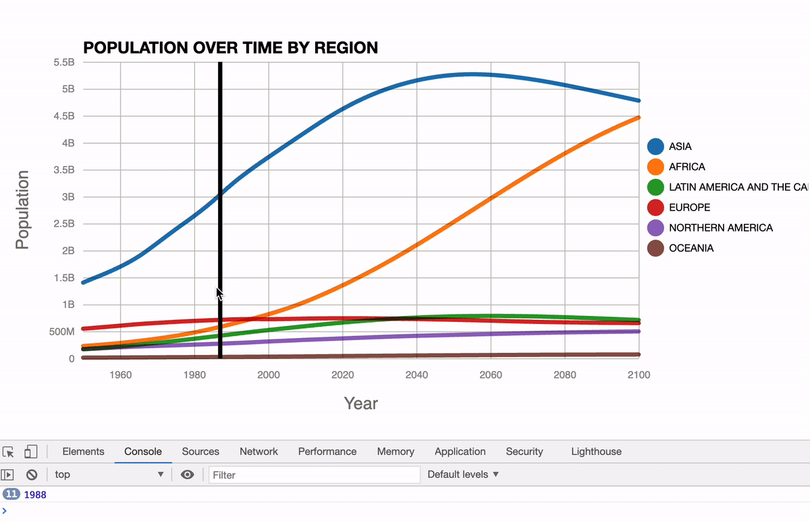

# Select a Year on a Line Chart
This Chart also include the section Melting and Munging Data with JavaScript
following the video tutorial on FreeCodeCamp.org made by Curran Kelleher: https://www.youtube.com/watch?v=_8V5o2UHG0E&list=WL&index=1&t=43174s

Data colors: https://sunlightfoundation.com/2014/03/12/datavizguide/

The source code by Curran is on VizHub:
[Melting and Munging Data with JavaScript](https://vizhub.com/curran/ecb0793c7d674100b3e3133d92cb6957)
[Selecting a Year on a Line Chart
](https://vizhub.com/curran/501f3fe24cfb4e6785ac75008b530a83)

This repository used [rollup.js](https://rollupjs.org/) as the JavaScript module bundler.

## Demo


## View the outcome
Open `public/index.html` in modern browser such as Chrome or Firefox directly. 

## Further development
To further develop the project by updating JavaScript, can run

```javascript

npm run bulid

```

or **watch** changes and auto compile:
```javascript
npm run watch
```

### Note for rollup.config.js settings
The output file format must be 'iife' to make advanced function work. 